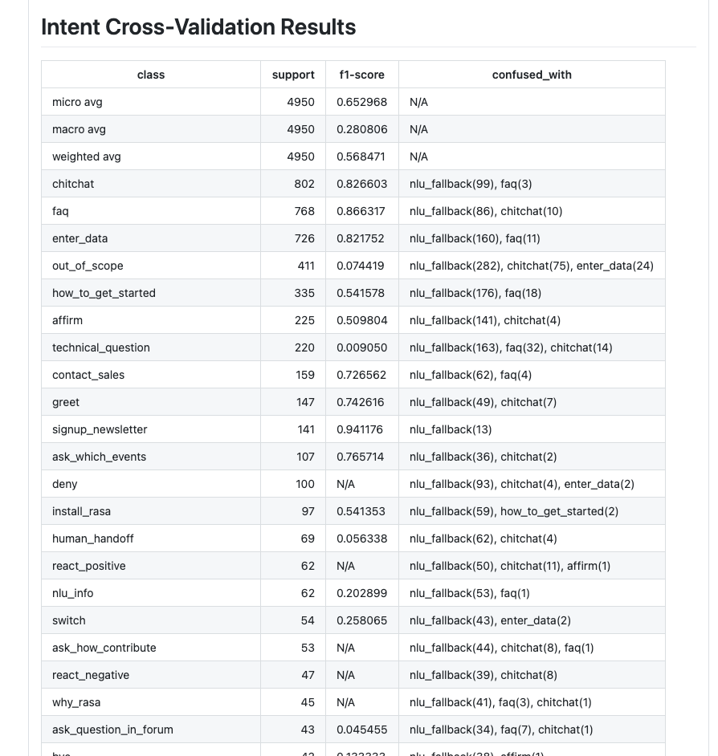

# Rasa Train and Test GitHub Action

The GitHub action to run easily `rasa train` and `rasa test` in the CIs.

## Input arguments

In order to pass the input parameters to the GH action, you have to use the [`with`](https://docs.github.com/en/actions/reference/workflow-syntax-for-github-actions#jobsjob_idstepswith) argument in a step that uses the GH action, e.g.

```yaml
jobs:
  my_first_job:
    steps:
      - name: My first step
        uses: RasaHQ/rasa-train-test-gha@master
        with:
          test_type: nlu
```

|        Input         |                                  Description                                  |          Default          |
| -------------------- | ----------------------------------------------------------------------------- | ------------------------- |
| `rasa_version`       | The Rasa version used to run test and train                                   | `latest-full`             |
| `rasa_image`         | Custom Docker image                                                           | `none`                    |
| `rasa_train`         | Run the rasa train                                                            | `true`                    |
| `rasa_test`          | Run the rasa test                                                             | `true`                    |
| `data_validate`      | Validates domain and data files to check for possible mistakes                | `true`                    |
| `workspace`          | The root directory                                                            | `${{ github.workspace }}` |
| `train_args`         | Additional arguments passed to the rasa train command                         | `none`                    |
| `test_args`          | Additional arguments passed to the rasa test command                          | `none`                    |
| `test_type`          | The types of tests to run (available types: core/nlu/all)                     | `all`                     |
| `publish_summary`    | Publish tests summary as a PR comment                                         | `true`                    |
| `github_token`       | GitHub Token - required to add a comment with summary                         | `none`                    |
| `configuration`      | Model configuration file                                                      | `config.yml`              |
| `model`              | Path to a file with a model. Use existing model instead of training a new one | `none`                    |
| `cross_validation`   | Switch on cross validation mode. Any provided model will be ignored           | `false`                   |
| `configuration_name` | Configuration name used in summary. If not provided a file name is used       | `none`                    |
| `data_name`          | Data name used in summary. If not provided a directory name is used           | `default`                 |
| `compare_report`     | Path to a report that will be used to compare results                         | `none`                    |

## Outputs

The list of available output variables:

|  Output  |      Description      |
| -------- | --------------------- |
| `report` | Return report as JSON |

## Report

The GH action generates two reports, a report with a summary of run tests, the report is available as JSON and CSV file. The example of a report generated by the GH action can be found [here](examples/).

## Example Usage

In the example below, we are using [the Rasa Demo data](https://github.com/RasaHQ/rasa-demo).

```yaml
jobs:
    tran_and_test:
        # ...
        steps:
            # ...
            - name: Train and Test Rasa Demo
              uses: RasaHQ/rasa-train-test-gha@master
              with:
                # List of available tags: https://hub.docker.com/r/rasa/rasa/tags
                rasa_version: '2.0.0-full'
                github_token: ${{ secrets.GITHUB_TOKEN }}
            # ...
```

The GitHub action by default adds a PR comment with summary (the summary comment can be disabled by setting the `publish_summary` input argument to `false`):


### Use JSON report in GH workflow

The GH action returns a JSON report as an output. The following example shows how to use the output in a GH workflow.

```yaml
jobs:
    tran_and_test:
        # ...
        steps:
            # ...
            - name: Train and Test Rasa Demo
              id: action
              uses: RasaHQ/rasa-train-test-gha@master
              with:
                # List of available tags: https://hub.docker.com/r/rasa/rasa/tags
                rasa_version: '2.0.0-full'
                github_token: ${{ secrets.GITHUB_TOKEN }}

            # We have to convert the output to JSON by using fromJSON built-in function
            # more: https://docs.github.com/en/free-pro-team@latest/actions/reference/context-and-expression-syntax-for-github-actions#fromjson
            # syntax: fromJSON(steps.action.outputs.report).<data_name>[<configuration_name|configuration>]
            # example: fromJSON(steps.action.outputs.report).default['config.yml']
            - name: Check output
              if: fromJSON(steps.action.outputs.report).default['config.yml'].intent_classification.accuracy >= 0.8
              run: |
                echo "I'm doing extra work..."
                echo ${{ fromJSON(steps.action.outputs.report).default['config.yml'].intent_classification.accuracy }}
```

## Advanced examples

### Compare results with the base report

It possible to compare results to the other report. The difference against the report that we compare to is included in brackets.

```yaml
jobs:
    tran_and_test:
        # ...
        steps:
            # ...
            - name: Train and Test Rasa Demo
              uses: RasaHQ/rasa-train-test-gha@master
              with:
                # List of available tags: https://hub.docker.com/r/rasa/rasa/tags
                rasa_version: '2.0.0-full'
                github_token: ${{ secrets.GITHUB_TOKEN }}
                # A path to the report that we want to compare to
                compare_report: 'report_to_compare.json'
                test_type: 'nlu'
            # ...
```


### Use the existing model

It's possible to use the existing model instead of training a new one.

```yaml
jobs:
    test:
        # ...
        steps:
            # ...
            - name: Download Rasa X model
              run: |
                wget https://github.com/RasaHQ/rasa-x-demo/blob/0.33.0/models/model.tar.gz?raw=true \
                  -O test_model.tar.gz

            - name: Train and Test Rasa Demo
              uses: RasaHQ/rasa-train-test-gha@master
              with:
                # List of available tags: https://hub.docker.com/r/rasa/rasa/tags
                rasa_version: '2.0.0-full'
                github_token: ${{ secrets.GITHUB_TOKEN }}
                # If a file with the model is provided, training is disabled automatically
                model: test_model.tar.gz
            # ...
```

### Cross-validate NLU model

```yaml
jobs:
    tran_and_test:
        # ...
        steps:
            # ...
            - name: Train and Test Rasa Demo
              uses: RasaHQ/rasa-train-test-gha@master
              with:
                # List of available tags: https://hub.docker.com/r/rasa/rasa/tags
                rasa_version: '2.0.0-full'
                github_token: ${{ secrets.GITHUB_TOKEN }}
                # Switch on cross validation mode. Any provided model will be ignored
                cross_validation: 'true'
                # Number of cross validation folds (cross validation only)
                # All available arguments: rasa test nlu --help
                test_args: '--folds 3'
                test_type: 'nlu'
            # ...
```

In a case where the cross-validation mode is enabled, a summary published as a PR comment includes `Intent Cross-Validation Results` and `Entity Cross-Validation Results`, e.g.




### Upload results and reports as artifacts

```yaml
jobs:
    tran_and_test:
        # ...
        steps:
            # ...
            - name: Train and Test Rasa Demo
              id: action
              uses: RasaHQ/rasa-train-test-gha@master
              with:
                # List of available tags: https://hub.docker.com/r/rasa/rasa/tags
                rasa_version: '2.0.0-full'
                github_token: ${{ secrets.GITHUB_TOKEN }}

            # The 'actions/upload-artifact' action to upload files
            # More: https://github.com/actions/upload-artifact
            - uses: actions/upload-artifact@v2
              with:
                name: rasa-demo-cfg
                path: |
                  results
                  reports
```
